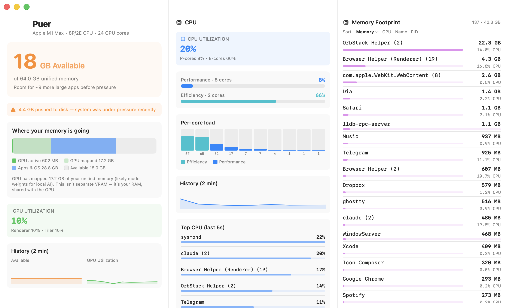

# Puer

SwiftUI windowed app for monitoring macOS CPU, GPU, and unified memory.

> [!NOTE]
> This app was vibe coded using Opus 4.6 / 4.8, GPT-5.4, and Fable 5.



## Features

- **"Used" memory headline** (available beneath it) over a breakdown grid: app memory (Activity Monitor's internal-minus-purgeable definition) with its purgeable and speculative caches, wired memory against the `iogpu.wired_limit_mb` limit with remaining headroom, and compressed memory beside the live kernel pressure verdict and last-event clock
- **Unified memory pool visualization** showing GPU-mapped memory, apps/OS, and available space as competing claims on one shared pool, rather than displaying as if the GPU has its own VRAM
- Live Apple Silicon GPU utilization from `AGXAccelerator` `PerformanceStatistics`
- **CPU load split by core type**: overall utilization plus separate performance-core and efficiency-core loads, and a per-core bar for every logical core
- **Top CPU consumers over the last ~5s**: a recent-window ranking from per-process CPU-time deltas
- **Physical memory footprint** for per-process memory (the same metric Activity Monitor uses) instead of RSS, which inflates numbers by counting shared pages multiple times
- **Labeled trend charts (last 5 min)**: available memory, GPU utilization, GPU memory in-use, and CPU load
- **Copy Report button**: one click copies a plaintext diagnostic block for export
- **Memory pressure visualization**: a dedicated swap card (on disk, session swap out, split in/out rates) with pressure shown in permanent grid cells and event growers captured in the report
- **Device information**: hardware summary, thermal state, and power mode
- **Runs in the Dock**, not the menu bar: closing the window keeps the app alive and collecting; reopen from the Dock

## How measurement works

Puer uses macOS system interfaces and command-line tools rather than private frameworks.

### Memory

- Total physical memory comes from `sysctl hw.memsize`.
- Memory breakdown comes from `host_statistics64(HOST_VM_INFO64)`, using page counters such as active, inactive, wired, compressed, speculative, free, and purgeable.
- **Available memory** is computed as `total - used`, where used is `total - free - speculative - purgeable`. This avoids double-counting purgeable and inactive pages, which can otherwise inflate the number beyond physical RAM.
- Swap usage comes from `sysctl vm.swapusage`.
- Memory pressure is derived from `/usr/bin/memory_pressure` by parsing the reported system-wide free percentage (legacy signal), alongside the kernel's own verdict from `sysctl kern.memorystatus_vm_pressure_level` (1 normal / 2 warn / 4 critical).
- Thermal state comes from `ProcessInfo.thermalState` and Low Power Mode from `ProcessInfo.isLowPowerModeEnabled`; the configured GPU wired limit from `sysctl iogpu.wired_limit_mb` (0 = macOS default, labeled as such).
- Swap in/out rates are computed by diffing the cumulative `vm_statistics64` swap counters between samples. A "pressure event" (kernel level leaving normal, or swap-out exceeding 5 MB/s) is timestamped, and the top per-name footprint *growers* over the preceding refresh window are captured as the causal hint; growth rather than size, because the biggest resident isn't always the cause.

### GPU and unified memory

On Apple Silicon, there is no separate VRAM. The CPU and GPU share the same physical memory pool. Puer shows this as a single unified bar rather than separate sections:

- GPU model, core count, utilization, and tracked memory come from `/usr/sbin/ioreg -r -c AGXAccelerator -d 2`, specifically the `PerformanceStatistics` dictionary.
- **GPU mapped** (`Alloc system memory` from IOKit) is the total memory the GPU driver has reserved. On machines running local AI models, this can be very large (e.g. 70 GB for a large LLM) because the model weights are memory-mapped for GPU access.
- **GPU in-use** (`In use system memory` from IOKit) is the subset actively being read/written by the GPU right now.
- The gap between mapped and in-use is memory that's allocated (often wired/pinned) but idle, for example model weights that aren't being processed this instant.

### CPU

- Per-core load comes from `host_processor_info(PROCESSOR_CPU_LOAD_INFO)`, which reports cumulative user/system/idle/nice ticks per logical core. Utilization is the busy fraction between two samples.
- Cores are split into **performance** and **efficiency** clusters using `sysctl hw.perflevel0.logicalcpu` (performance) and `hw.perflevel1.logicalcpu` (efficiency). Empirically, `host_processor_info` enumerates the efficiency cores first (low indices) and the performance cores after, so the app maps indices accordingly.

### Per-process memory and recent CPU

- Process list comes from `ps -eo pid,rss,pcpu,comm -r`.
- Each process's memory is measured using **physical footprint** via `proc_pid_rusage(RUSAGE_INFO_V4)` and the `ri_phys_footprint` field. This is the same metric Activity Monitor shows in its "Memory" column. It avoids the problem where RSS (Resident Set Size) double-counts shared libraries and memory-mapped files across processes.
- **Recent CPU%** is computed from the same `proc_pid_rusage` call by diffing each process's cumulative CPU time (`ri_user_time + ri_system_time`) between samples, over the ~5s refresh window, so it reflects what's busy *now*, not the lifetime average `ps` reports. Note these fields are in mach time units, not nanoseconds, so they're converted via `mach_timebase_info`.
- Processes are aggregated by executable name with a count shown (e.g. `node (10)`).
- If `proc_pid_rusage` fails for a process (e.g. insufficient permissions for system processes), Puer falls back to RSS from `ps` for memory and to the `ps` `%CPU` value for CPU.

### Important limitations

- GPU stats are Apple-Silicon-specific. The current implementation depends on `AGXAccelerator`, so non-AGX Macs may show `Unknown` and zeroed GPU values.
- Pressure events and history only cover the window since the app launched.
- The unified pool bar is an exact partition of physical memory built from kernel and driver counters. Wired is shown as GPU In-Use plus everything-else-pinned; a finer GPU-vs-OS split within wired is not publicly measurable and is deliberately not guessed.
- The `ioreg` parsing is text-based, so future macOS formatting changes could break some fields.
- Process aggregation by binary name can merge unrelated processes with the same executable name.

## Building

The app is an Xcode project that builds a real `Puer.app`:

```bash
git clone https://github.com/Trickle-downIaC/puer
cd puer
open Puer.xcodeproj   # then hit Run in Xcode
```

Or from the command line:

```bash
xcodebuild -project Puer.xcodeproj -scheme Puer -configuration Debug build
```

`Puer.xcodeproj` is committed and needs no extra tooling to open. It's generated from `project.yml` via [XcodeGen](https://github.com/yonaskolb/XcodeGen) (`brew install xcodegen && xcodegen generate`), which you only need if you want to regenerate the project.

**Setting an app icon:** in Xcode, open `Assets.xcassets` → `AppIcon` and drop your images into the slots (or provide a single 1024×1024 PNG and let Xcode generate the sizes).

The app deliberately runs **without App Sandbox** because it shells out to `ioreg`, `ps`, and `memory_pressure`.

### Quick build without Xcode

For a throwaway run (bare binary, no `.app` bundle, no icon):

```bash
swiftc -parse-as-library -framework SwiftUI -framework AppKit -framework IOKit -o Puer GpuerApp.swift
./Puer
```

Requires macOS and Xcode command line tools (`xcode-select --install`).
